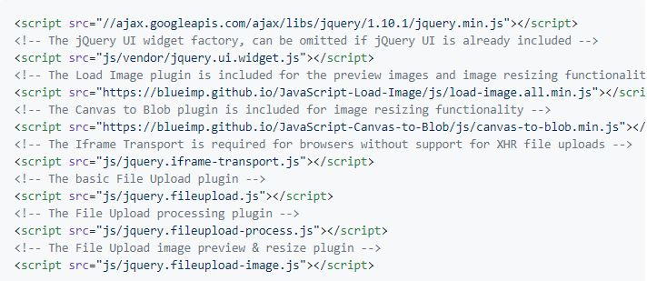
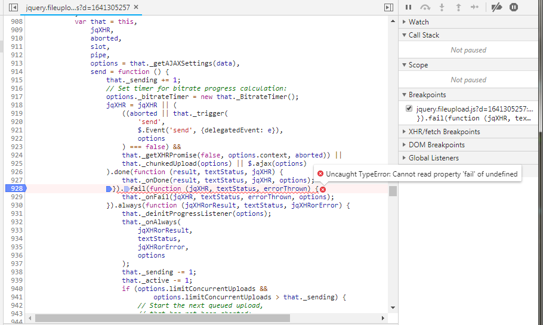
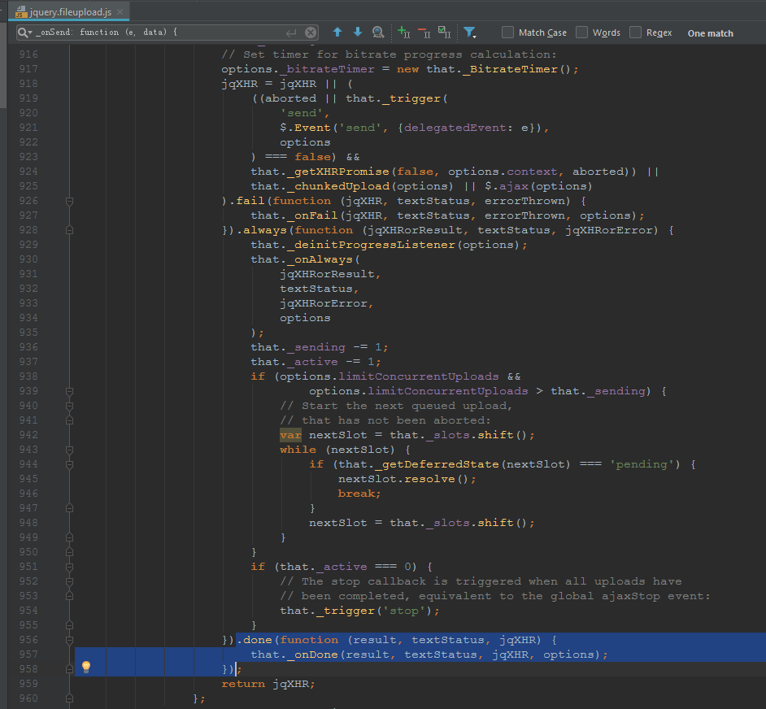
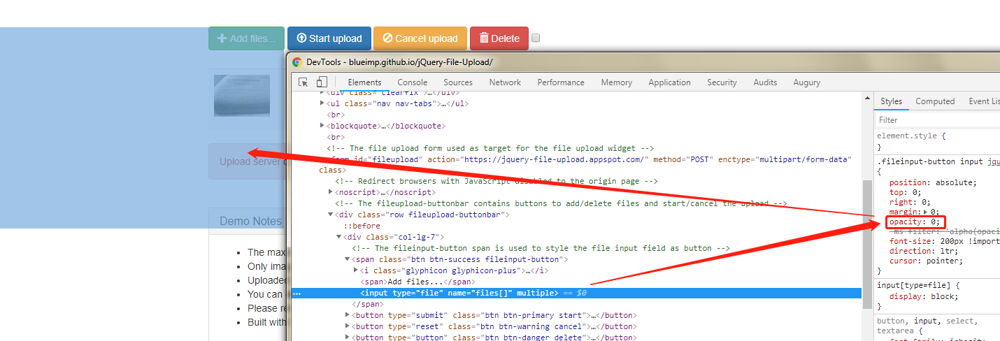

# 引言
项目以前使用的[SWFUpload](https://baike.baidu.com/item/SWFUpload/10178031?fr=aladdin)上传组件，[中文文档](http://www.cnblogs.com/youring2/archive/2012/07/13/2590010.html)度娘随处可以搜到，基于js+flash，但是近几年谷爷越来越不待见flash，导致Chrome在加载flash的时候总要手动允许，而且关闭浏览器后再次打开还需要再次允许，使用非常不便，所以...
[jQuery File Upload](https://github.com/blueimp/jQuery-File-Upload)是功能强大的jQuery上传组件，可以先看看[DEMO](https://blueimp.github.io/jQuery-File-Upload/index.html)，各种上传必须的功能都支持，如下：
* 多个文件同时上传
* 文件拖拽
* 上传进度条
* 支持取消上传
* 支持大文件上传
* 支持客户端改变图片尺寸
* 支持预览
* 无需任何flash插件
* 支持跨域上传
* 一个页面可以有多个上传控件
* 支持标准的multipart/form-data

也许是我理解力差，也许是我英语二把刀，使用官方给出的[WIKI](https://github.com/blueimp/jQuery-File-Upload/wiki)来实现我的功能，着实费了一番大工夫，来看看我踩得坑。

# 开始坑爹之路

## 引入后js报错
我使用的是可压缩图片的上传，参看官网[Client side Image Resizing](https://github.com/blueimp/jQuery-File-Upload/wiki/Client-side-Image-Resizing)引入对应的js组件，按顺序，一定要按顺序；

注意：canvas-to-blob.min.js、load-image.all.min.js组件里没有，你得自己下载；
OK，一切就绪，启动上传，报错：

这是_onSend()函数里面的错误，直接导致后续progress、fail、success无法执行；删除fail调用链，always报错，删除always调用链，一切正常；所以推测，可能是done函数的调用导致的问题，所以将源代码改了改

将done移动到了最后位置，一切正常了。。。猜测是解决问题了，但是原因还有点懵，难道造成这个是我用的jQuery-1.11.3.js、jQuery-UI-1.10.3.js的原因吗？

## 关于always
源文件中给出always事件的注释如下：

// Callback for completed (success, abort or error) requests:
// always: function (e, data) {}, // .bind('fileuploadalways', func);

我的理解是，在success, abort or error请求完成后，调用此事件，所以自热而然的理解为是调用完done(fileuploaddone)、fail(fileuploadfail)事件后，再调用always(fileuploadalways)，然而并不是，always是在这俩事件之前调用。

## 关于abort
取消上传，官网给了样例，如下：

Uploads can be canceled by invoking the abort method on a jqXHR object:
    
    var jqXHR = $('#fileupload').fileupload('send', {files: filesList})
        .error(function (jqXHR, textStatus, errorThrown) {
            if (errorThrown === 'abort') {
                alert('File Upload has been canceled');
            }
        });
    $('button.cancel').click(function (e) {
        jqXHR.abort();
    });
    

如果要使用这个功能，需要保存所有上传对象，非常麻烦；后来发现在事件add中，第二个参数data有abort方法，直接调用就可以阻止上传；

.bind('fileuploadadd', function (e, data) {
    data.abort();
})

但是，data.abort()在其他事件中如send调用是无效，无法阻止；change事件里的data无abort方法；

## 关于全部阻止上传
可以设置一个全局标志位，在fileuploadadd中加上判断，如果全局标志位阻止上传，那么执行data.abort()方法；反之不执行；

## 关于图片压缩
官网给的样例如下：

    
    $('#fileupload').fileupload({
        url: '//jquery-file-upload.appspot.com/',
        dataType: 'json',
        // Enable image resizing, except for Android and Opera,
        // which actually support image resizing, but fail to
        // send Blob objects via XHR requests:
        disableImageResize: /Android(?!.*Chrome)|Opera/
            .test(window.navigator && navigator.userAgent),
        imageMaxWidth: 800,
        imageMaxHeight: 800,
        imageCrop: true // Force cropped images
    })
    

disableImageResize：false，就可以开启图片压缩；

## 关于上传图标样式

<input type="file" id="jQueryFileUploadButton" name="Filedata" multiple/>

由于此组件使用html原生上传按钮，那是非常难看，而且这个按钮还有个霸王条款，不许trigger('click')来触发点击，只能鼠标点击；官方给出了解决办法：

先做一个好看的按钮放在那，将上传按钮全透明后，覆盖在好看按钮上面，艾玛，没有做不到，只有想不到，大写的服气。。。

## 关于singleFileUploads

// By default, each file of a selection is uploaded using an individual
// request for XHR type uploads. Set to false to upload file
// selections in one request each:
singleFileUploads: true,

这个意思是设置为true，一次可以选择多个图片，但是每个图片作为单独请求上传，那么change事件调用一次，add事件、send事件等会循环调用；

...
.bind('fileuploadchange', function (e, data) {
    // 调用一次
    // data.files 是所有上传文件
}).bind('fileuploadadd', function (e, data) {
    // 多次调用
    // data.files 只有一个文件
}).bind('fileuploadsend', function (e, data) {
    // 多次调用
    // data.files 只有一个文件
}).bind('fileuploadprogress', function (e, data) {
    // 每个文件单独的进度
}).bind('fileuploadprogressall', function (e, data) {
    // 所有文件的进度
})
...

但是如果singleFileUploads: false,那就是把所有文件当做一个请求上传，所有的事件都只会调用一次，成功所有文件上传完成，一个失败，所有都没有上传。

## 关于事件调用

$('#fileupload').fileupload({
    url:'',
    autoUpload: true,
    sequentialUploads: true,
    change: function (e, data) {/* ... */}),
    add: function (e, data) {/* ... */}),
    send: function (e, data) {/* ... */}),
    ...
    });


$('#fileupload').fileupload({
    url:'',
    autoUpload: true,
    sequentialUploads: true,
    })
    .bind('fileuploadchange', function (e, data) {/* ... */})
    .bind('fileuploadadd', function (e, data) {/* ... */})
    .bind('fileuploadsend', function (e, data) {/* ... */});
...

不要纠结，这两种绑定一样一样，爱用哪个就用哪个。
## 关于官网API
jQuery File Upload组件提供很多属性，但是官网API没有对应解释，只有个别样例，只能看源码里面的注释，作者很相信大家的能力。

options: {
    // The drop target element(s), by the default the complete document.
    // Set to null to disable drag & drop support:
    dropZone: $(document),
    // The paste target element(s), by the default undefined.
    // Set to a DOM node or jQuery object to enable file pasting:
    pasteZone: undefined,
    // The file input field(s), that are listened to for change events.
    // If undefined, it is set to the file input fields inside
    // of the widget element on plugin initialization.
    // Set to null to disable the change listener.
    fileInput: undefined,
    // By default, the file input field is replaced with a clone after
    // each input field change event. This is required for iframe transport
    // queues and allows change events to be fired for the same file
    // selection, but can be disabled by setting the following option to false:
    replaceFileInput: true,
    // The parameter name for the file form data (the request argument name).
    // If undefined or empty, the name property of the file input field is
    // used, or "files[]" if the file input name property is also empty,
    // can be a string or an array of strings:
    paramName: undefined,
    // By default, each file of a selection is uploaded using an individual
    // request for XHR type uploads. Set to false to upload file
    // selections in one request each:
    singleFileUploads: true,
    // To limit the number of files uploaded with one XHR request,
    // set the following option to an integer greater than 0:
    limitMultiFileUploads: undefined,
    // The following option limits the number of files uploaded with one
    // XHR request to keep the request size under or equal to the defined
    // limit in bytes:
    limitMultiFileUploadSize: undefined,
    // Multipart file uploads add a number of bytes to each uploaded file,
    // therefore the following option adds an overhead for each file used
    // in the limitMultiFileUploadSize configuration:
    limitMultiFileUploadSizeOverhead: 512,
    // Set the following option to true to issue all file upload requests
    // in a sequential order:
    sequentialUploads: false,
    // To limit the number of concurrent uploads,
    // set the following option to an integer greater than 0:
    limitConcurrentUploads: undefined,
    // Set the following option to true to force iframe transport uploads:
    forceIframeTransport: false,
    // Set the following option to the location of a redirect url on the
    // origin server, for cross-domain iframe transport uploads:
    redirect: undefined,
    // The parameter name for the redirect url, sent as part of the form
    // data and set to 'redirect' if this option is empty:
    redirectParamName: undefined,
    // Set the following option to the location of a postMessage window,
    // to enable postMessage transport uploads:
    postMessage: undefined,
    // By default, XHR file uploads are sent as multipart/form-data.
    // The iframe transport is always using multipart/form-data.
    // Set to false to enable non-multipart XHR uploads:
    multipart: true,
    // To upload large files in smaller chunks, set the following option
    // to a preferred maximum chunk size. If set to 0, null or undefined,
    // or the browser does not support the required Blob API, files will
    // be uploaded as a whole.
    maxChunkSize: undefined,
    // When a non-multipart upload or a chunked multipart upload has been
    // aborted, this option can be used to resume the upload by setting
    // it to the size of the already uploaded bytes. This option is most
    // useful when modifying the options object inside of the "add" or
    // "send" callbacks, as the options are cloned for each file upload.
    uploadedBytes: undefined,
    // By default, failed (abort or error) file uploads are removed from the
    // global progress calculation. Set the following option to false to
    // prevent recalculating the global progress data:
    recalculateProgress: true,
    // Interval in milliseconds to calculate and trigger progress events:
    progressInterval: 100,
    // Interval in milliseconds to calculate progress bitrate:
    bitrateInterval: 500,
    // By default, uploads are started automatically when adding files:
    autoUpload: true,

    // Error and info messages:
    messages: {
        uploadedBytes: 'Uploaded bytes exceed file size'
    },

    // Translation function, gets the message key to be translated
    // and an object with context specific data as arguments:
    i18n: function (message, context) {
        message = this.messages[message] || message.toString();
        if (context) {
            $.each(context, function (key, value) {
                message = message.replace('{' + key + '}', value);
            });
        }
        return message;
    },

    // Additional form data to be sent along with the file uploads can be set
    // using this option, which accepts an array of objects with name and
    // value properties, a function returning such an array, a FormData
    // object (for XHR file uploads), or a simple object.
    // The form of the first fileInput is given as parameter to the function:
    formData: function (form) {
        return form.serializeArray();
    },

    // The add callback is invoked as soon as files are added to the fileupload
    // widget (via file input selection, drag & drop, paste or add API call).
    // If the singleFileUploads option is enabled, this callback will be
    // called once for each file in the selection for XHR file uploads, else
    // once for each file selection.
    //
    // The upload starts when the submit method is invoked on the data parameter.
    // The data object contains a files property holding the added files
    // and allows you to override plugin options as well as define ajax settings.
    //
    // Listeners for this callback can also be bound the following way:
    // .bind('fileuploadadd', func);
    //
    // data.submit() returns a Promise object and allows to attach additional
    // handlers using jQuery's Deferred callbacks:
    // data.submit().done(func).fail(func).always(func);
    add: function (e, data) {
        if (e.isDefaultPrevented()) {
            return false;
        }
        if (data.autoUpload || (data.autoUpload !== false &&
                $(this).fileupload('option', 'autoUpload'))) {
            data.process().done(function () {
                data.submit();
            });
        }
    },

    // Other callbacks:

    // Callback for the submit event of each file upload:
    // submit: function (e, data) {}, // .bind('fileuploadsubmit', func);

    // Callback for the start of each file upload request:
    // send: function (e, data) {}, // .bind('fileuploadsend', func);

    // Callback for successful uploads:
    // done: function (e, data) {}, // .bind('fileuploaddone', func);

    // Callback for failed (abort or error) uploads:
    // fail: function (e, data) {}, // .bind('fileuploadfail', func);

    // Callback for completed (success, abort or error) requests:
    // always: function (e, data) {}, // .bind('fileuploadalways', func);

    // Callback for upload progress events:
    // progress: function (e, data) {}, // .bind('fileuploadprogress', func);

    // Callback for global upload progress events:
    // progressall: function (e, data) {}, // .bind('fileuploadprogressall', func);

    // Callback for uploads start, equivalent to the global ajaxStart event:
    // start: function (e) {}, // .bind('fileuploadstart', func);

    // Callback for uploads stop, equivalent to the global ajaxStop event:
    // stop: function (e) {}, // .bind('fileuploadstop', func);

    // Callback for change events of the fileInput(s):
    // change: function (e, data) {}, // .bind('fileuploadchange', func);

    // Callback for paste events to the pasteZone(s):
    // paste: function (e, data) {}, // .bind('fileuploadpaste', func);

    // Callback for drop events of the dropZone(s):
    // drop: function (e, data) {}, // .bind('fileuploaddrop', func);

    // Callback for dragover events of the dropZone(s):
    // dragover: function (e) {}, // .bind('fileuploaddragover', func);

    // Callback before the start of each chunk upload request (before form data initialization):
    // chunkbeforesend: function (e, data) {}, // .bind('fileuploadchunkbeforesend', func);

    // Callback for the start of each chunk upload request:
    // chunksend: function (e, data) {}, // .bind('fileuploadchunksend', func);

    // Callback for successful chunk uploads:
    // chunkdone: function (e, data) {}, // .bind('fileuploadchunkdone', func);

    // Callback for failed (abort or error) chunk uploads:
    // chunkfail: function (e, data) {}, // .bind('fileuploadchunkfail', func);

    // Callback for completed (success, abort or error) chunk upload requests:
    // chunkalways: function (e, data) {}, // .bind('fileuploadchunkalways', func);

    // The plugin options are used as settings object for the ajax calls.
    // The following are jQuery ajax settings required for the file uploads:
    processData: false,
    contentType: false,
    cache: false,
    timeout: 0
}
