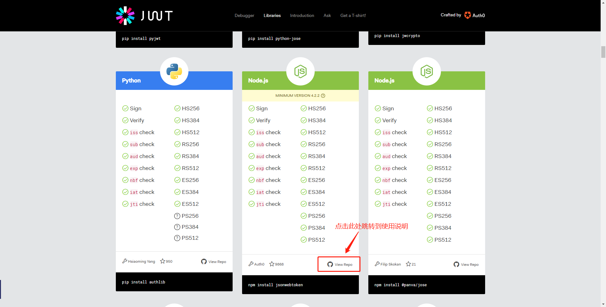

# 引言
最近开始着手一个前后端分离的项目，做到用户认证，使用[JWT](https://jwt.io/)，不了解可以参看[JSON Web Token 入门教程](http://www.ruanyifeng.com/blog/2018/07/json_web_token-tutorial.html),由于后端代码还没有，所以需要使用nodeJS模拟生成出JWT串，返回给前端使用。

# 如何生成
要使用nodeJS生成非常简单，就像把大象装进冰箱一样，只要三步：
1. 引入依赖组件
```sh
npm install jsonwebtoken --save 
```
2. 加入到文件中，调用sign方法生成；
```javascript
let jwt = require('jsonwebtoken');

let token = jwt.sign({/** **/});
```
3. 输出到前端；
```javascript
ctx.response.body = token;
```
# 详细解说sign方法
sign方法里面需要参数，可以参照[JWT](https://jwt.io/)给出的说明来填写，官网给出很多语言的帮助文档，比如本文用的NodeJS：

跳转到[帮助文档](https://github.com/auth0/node-jsonwebtoken)后，可以看到sign方法需要三个参数
```javascript
jwt.sign(payload, secretOrPrivateKey, [options, callback])
```
## 第一个参数payload
JSON对象，把自己想要输出的数据都放在这个对象里面；
```json
{
    userName: user,
    user_name: "admin",
    urls: [
        "/claim/getTaskList"
    ],
    authorities: [
        "ROLE_USER"
    ],
    menus: {
        personalMenu: [
            {
                field: "mobileSurvey",
                href: "mobileSurvey",
                type: "A01"
            },
            {
                field: "injuryEst",
                href: "",
                type: "B02"
            }
        ],
        managementMenu: []
    }
}
```

## 第二个参数
密码串；非对称加密把私钥填在这儿；

## 第三个参数
* algorithm：加密类型（默认：HS256）
* expiresIn：有效期；格式：[zeit/ms](https://github.com/zeit/ms)（数字：60 为60秒；字符串："2days"为2天，也可以写为"2d"；"10h"为10小时；如果字符串"60"不写单位为60毫秒）
* notBefore
* audience
* issuer
* jwtid
* subject
* noTimestamp
* header
* keyid
* mutatePayload:如果为真，sign函数将直接修改payload对象。如果您需要在对payload应用声明之后、但在将其编码为令牌之前对其进行原始引用，那么这是非常有用的。
