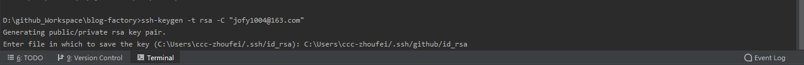

# 引言
想把代码既提交到[github](https://github.com/)，又提交到[coding](https://coding.net/)该如何做呢？

# 创建账号、创建项目
这两个网站都需要账号（废话），接着创建两个空项目（废话），把代码库地址记住，然后创建publickey；

# 创建publickey
```
ssh-keygen -t rsa -C "邮箱地址"
```
名字可以随便定义，要区分开git和coding，比如我把github的key就放在了github文件夹下，如下图：


然后一路回车完毕，在对应存放的地址中找到id_rsa.pub文件


打开后复制串，然后打开github创建ssh key；


coding创建publickey同上；

# 关联代码仓库
如果以前代码关联过远程仓库，需要移除的话请使用下面命令
```
git remote rm origin
```
注意，现在远程仓库既有github，又有coding，所以远程仓库就不能使用默认的origin，我们要给他起特殊名字，比如往github提交，起的名字就是github
```
git remote add github git@github.com:jofy1004/blog-factory.git
```
往coding提交，起的名字就叫coding
```
git remote add coding git@e.coding.net:jofy1004/blog-factory.git
```
然后查看绑定的远程仓库
```
git remote -v 
```


# 推送代码
推送代码分别使用
```
git push github master

git push coding master 
```
这时候发现推送不成功


错误是设置的key不对，使用命令
```
ssh -v git@github.com
```


我们改过名字的key，没有识别到，所以要把改过名字的key加到里面，使用命令
```
ssh-add C:/Users/ccc-zhoufei/.ssh/github/id_rsa

ssh-add C:/Users/ccc-zhoufei/.ssh/coding/id_rsa
```

如果使用以上命令出错，请先执行
```
eval $(ssh-agent)
```


设置完成后，在执行push，就可以分别推送到远程分支了；


