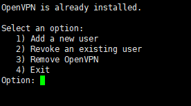
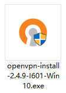

# 引言
最近vpn查封的较严，导致我的chrome无法登录，邮箱无法打开，书签无法同步，我又是个懒人，不想搞书签导出什么的，所以就想自己搭个vpn服务，仅做学习交流使用。

# 首先我们需要个国外的VPS
国外有好多VPS服务商，有的不支持中文，对于二把刀英语的我来说麻烦；有的由于**，不支持VPN服务，反正各种原因，最后选了[HostMem](https://www.hostmem.com/),支持中文，支持vpn，最便宜的$12.99/年，价格合理。
买之，创建了经典云服务器，服务器信息都可以在概括中找到，用xshell直接连接；


# 创建VPN服务
最开始选用的是shadowsocks，服务端好了，客户端用[小飞机](https://tlanyan.me/shadowsock-clients/)，就是连接不成功。不知道缘由，没办法改成了openVPN;

## 开始openVPN服务端配置
> 参考文章：
>[在RHEL/CentOS 8上安装和配置OpenVPN Server的方法](https://ywnz.com/linuxyffq/4592.html)
>[使用nmcli连接到Linux系统中的OpenVPN Server](https://ywnz.com/linuxjc/4226.html)

### 下载git
因为要去github获取openVPN的安装文件
```shell
sudo dnf -y install git
```
### 下载openVPN
```shell
git clone https://github.com/Nyr/openvpn-install.git
```
### 执行安装openVPN
进入openvpn-install目录，执行安装脚本
```shell
chmod +x openvpn-install.sh
sudo ./openvpn-install.sh
```
### 创建服务端
一路飙车（Enter、Enter...），成功后，到此openVPN的服务端就配置好了，配置文件在``/etc/openvpn/server/server.conf``。
### 生成客户端
接下来要生成客户端配置文件，供客户端连接使用
```shell
cd /etc/openvpn-install
sudo ./openvpn-install.sh
```

### 下载客户端配置文件
生成的客户端文件保存至/root下面，把它下载下来一会要配置客户端使用。`友情提醒：下面这个命令要在客户端机器执行；`
```shell
scp 用户名@IP:/root/文件全名 本机保存地址
```
### 安装客户端应用
下载客户端，我是window10，所以下载win10版本的客户端，长这样↓

### 连接服务端
安装好后，打开提示，需要配置文件，把下载好的客户端文件按照路径放进去，我放在了安装目录下的/config文件夹中。客户端打开找不到看右下角

### 测试
接下来，连接之，然后测试

### 成功。。。