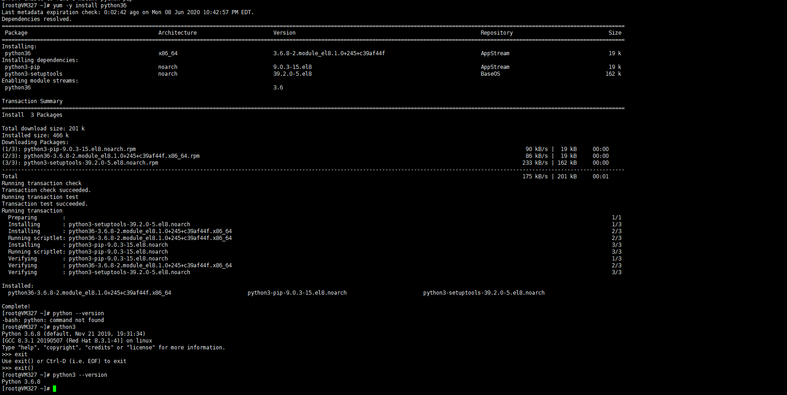
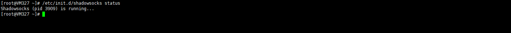

# 引言
今天又把shadowsocks拿出来配置，看看到底为啥不成功，话不多说，直接开始。

# 分步安装版
* 我使用的是CentOS 8，安装的是python3。
```python
yum -y install python36
```

* 输入命令，查看版本显示错误。
```shell
python --version
```
* 这是由于没有指定默认，设置默认值
```shell
sudo alternatives --set python /usr/bin/python3
```
* 接下来安装python-pip
```shell
curl https://bootstrap.pypa.io/get-pip.py -o get-pip.py
```
* 最后安装shadowsocks
```shell
pip install shadowsocks
```
* 创建shadowsocks.json文件
```shell
vim /etc/shadowsocks.json
```
* 将以下文本copy进去，保存
```shell
//此处进入vim文件编辑
{
  "server": "0.0.0.0",//这里不用改，全0代表地服务器监所有可用网络。
  "server_port": 6356,//服务器端口号，1025到65535任选一。
  "password": "mima123321",//设置登录密码。
  "method": "rc4-md5"//加密方式。
}
```
* 然后创建自启动服务
```shell
vim /etc/systemd/system/shadowsocks.service
```
* 将以下文本copy进去，保存
```shell
# 这里进入vim文件编辑
# 脚本内容如下：
[Unit]
Description=Shadowsocks

[Service]
TimeoutStartSec=0
ExecStart=/usr/bin/ssserver -c /etc/shadowsocks.json

[Install]
WantedBy=multi-user.target
```
* 启动、停止、查看状态
```shell
systemctl enable shadowsocks
systemctl start shadowsocks
systemctl status shadowsocks -l
```

很不幸的告诉大家，按照以上配置我没有成功启动，哇哈哈哈哈哈哈哈哈，服务器一直启动失败，不知所以然。

# 一键配置版

> 参考文章：[CentOS下shadowsocks一键安装脚本](https://www.idcjia.net/a15274711.html)

这个版本成功了，我怀疑分步版，可能创建json文件，里面编码集或者字符导致的问题。
* 下载别人写好的配置命令文件
```shell
wget --no-check-certificate https://raw.githubusercontent.com/teddysun/shadowsocks_install/master/shadowsocks.sh
```
* 给此文件赋权限
```shell
chmod +x shadowsocks.sh
```
* 直接运行脚本
```shell
./shadowsocks.sh
```
* 一步步跟着提示配置完，会显示成功，但是我试过几个脚本，虽然配置成功了，但是并没有启动，所以要查看服务状态，对应的命令如下：
```shell
/etc/init.d/shadowsocks start
/etc/init.d/shadowsocks stop
/etc/init.d/shadowsocks restart
/etc/init.d/shadowsocks status
```


# 最后测试
* 下载[小飞机](https://tlanyan.me/shadowsock-clients/)，连接测试成功，很奇怪，为啥最开始不行呢。