# 引言
继昨天搭建好了自己的vpn后，本着闲来无事要生事的原则，想起了朋友前几天说的python爬虫，随手就找了篇文章，依葫芦画瓢起来；本人不会python，所以只能现学现卖；
> 参考文章：[小白爬虫第一弹之抓取妹子图](https://cuiqingcai.com/3179.html)


# 搭建环境
* 安装python环境，[下载地址](https://www.python.org/downloads/release/python-383/)安装完成，打开cmd，查看安装是否成功。
```shell
py --version
```
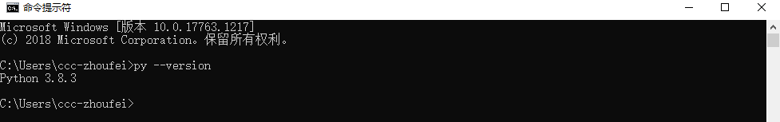
* 开发工具用的[PyCharm](https://www.jetbrains.com/pycharm/download/#section=windows)的windows Professional版。

# 创建项目
* 贴图直观，跟着下图一步一步
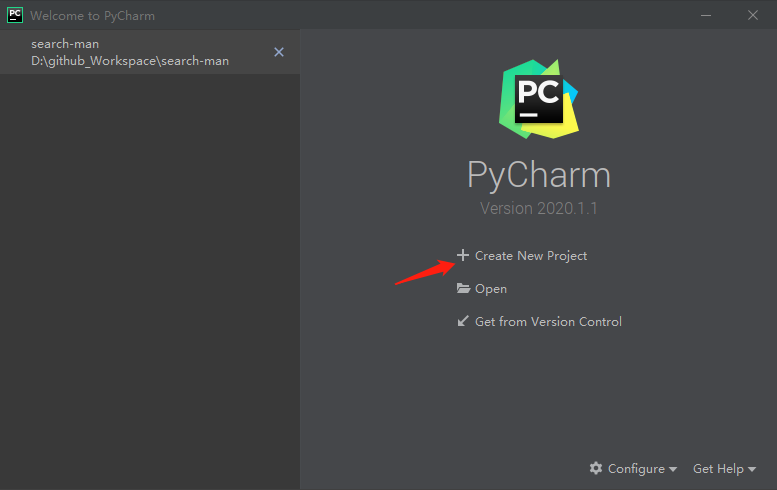
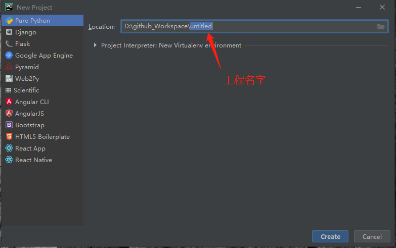
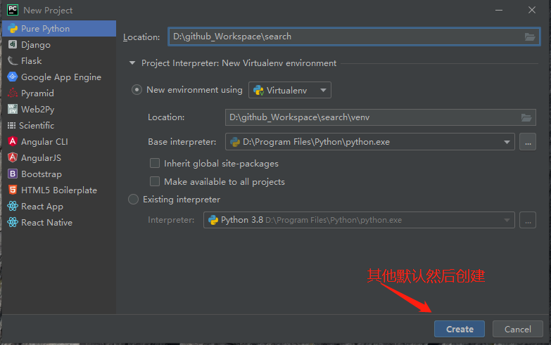
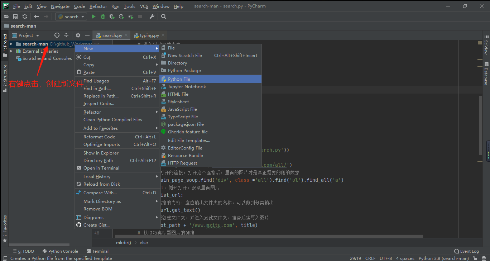

# 获取依赖库
requests是使用Apache2 licensed许可证的HTTP库；
[beautifulsoup](https://beautifulsoup.readthedocs.io/zh_CN/v4.4.0/#)是python用于html/xml文件中提取数据的库；
[lxml](https://lxml.de/index.html)是python对于html/xml解析库，支持XPath解析方式，而且解析效率非常高；

```shell
pip install requests
pip install beautifulsoup4
pip install lxml
```

# 分析网页元素，找到共同点,
* 首先目标网站是[妹子图](http://www.mzitu.com/all)；

* 接下来是图片的链接，因为这些链接打开后，才是批量的图片，我们的目标就是这些连接下所有的图片；
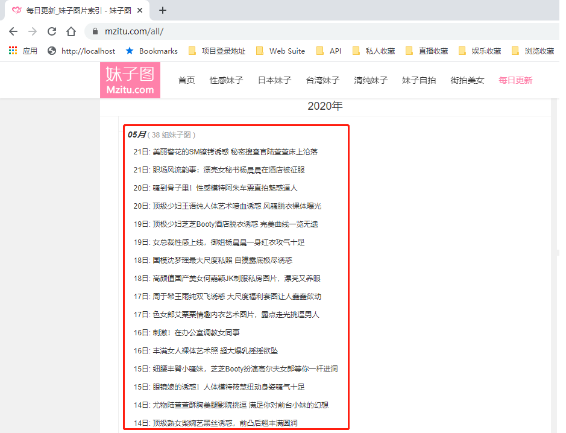
* F12、空白处右键->查看、Ctrl+Shift+i，都可以调出windows下chrome浏览器的控制台，如下图所示，目标就是&lt;ul class="archives"&gt;标签下的&lt;a href="****"&gt;标签里的href数据，如果打开这个链接，那么就能看到这个标题下的所有图片；
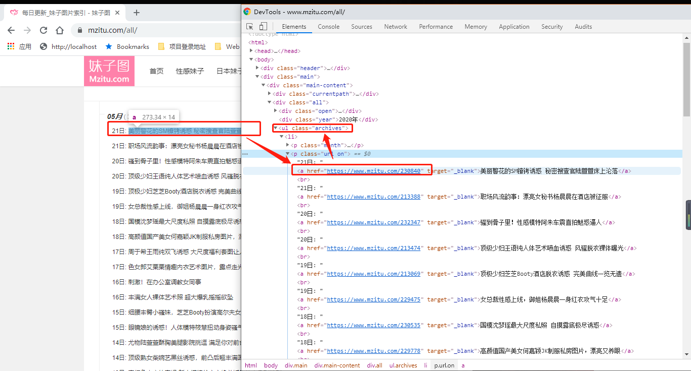
* 打开这个链接后，看到地址栏的地址中最后一位与翻页页码对应，也就是改变链接最后一位数字就可以拿到对应页码的图片，而图片真正的地址就在img标签的src中，只要有这个地址，就能拿到图片。
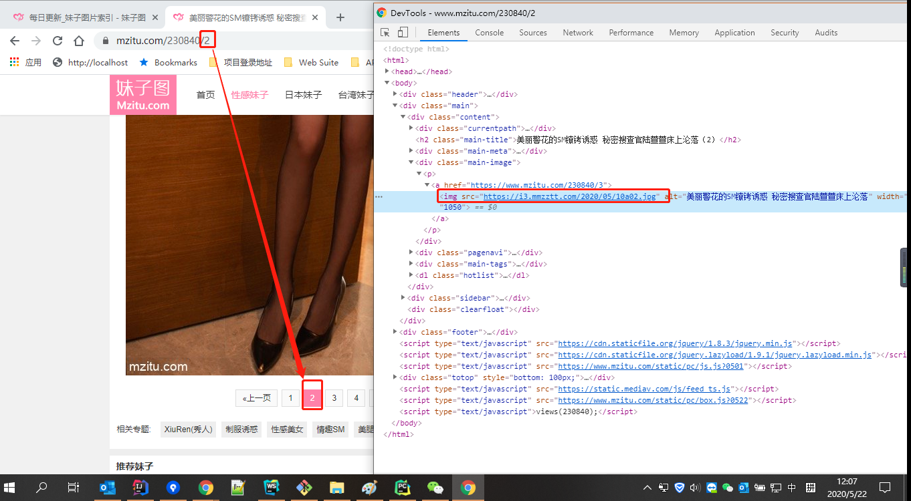

# 代码如下，[github下载源码](https://github.com/jofy1004/search-man.git)
```python
import requests
from bs4 import BeautifulSoup
import os


# 获取除了图片以外的HTML页面
def getHTMLText(url, code='utf-8'):
    # 定义请求头
    headers = {
        'User-Agent': "Mozilla/5.0 (Windows NT 6.1; WOW64) AppleWebKit/537.1 (KHTML, like Gecko) Chrome/22.0.1207.1 Safari/537.1"}
    # 发出get请求获取html页面资源
    html = requests.get(url, headers=headers)
    # 转成BeautifulSoup，可以供查询标签使用
    return BeautifulSoup(html.text, 'lxml')


# 按照分类创建输入目录
def mkdir(root_path, path):
    # 拼接存放图片的绝对路径
    path = os.path.join(root_path, str(path).strip())
    # 判断此路径是否已经存在
    if os.path.exists(path):
        # 进入到此文件夹中
        os.chdir(path)
        return path
    else:
        # 不存在，创建此路径
        os.makedirs(path)
        # 进入到此文件夹中
        os.chdir(path)
        return path


# 主程序入口
def main():
    # 获取图片存放的绝对路径
    root_path = os.path.abspath(os.path.dirname('search.py'))
    # 获取mzitu的Soup，用于后续查找使用
    main_page_soup = getHTMLText('https://www.mzitu.com/all/')
    # 查找每个需要打开的连接，打开这个连接后，里面的图片才是真正需要的爬的数据
    list_url = main_page_soup.find('div', class_='all').find('ul').find_all('a')
    # 获取到所有url，循环打开，获取里面图片
    for url in list_url:
        # 获取到连接的内容，座位输出文件夹的名称，可以做到分类输出
        title = url.get_text()
        # 按照标题创建文件夹，并进入到此文件夹，准备后续写入图片
        mkdir(root_path + '/www.mzitu.com', title)
        # 获取每类标题图片的链接
        href = url['href']
        # 防盗链
        ref_headers = {'referer': href,
                       'User-Agent': "Mozilla/5.0 (Windows NT 6.1; WOW64) AppleWebKit/537.1 (KHTML, like Gecko) Chrome/22.0.1207.1 Safari/537.1"}
        # 获取最大页码数
        # html_soup = getHTMLText(href)
        # max_num = html_Soup.find('div', class_='pagenavi').find_all('span')[-2].get_text()

        # 图片页码太多，所以这里我使用了固定5页，有需要全部的，把5可以替换成max_num+1
        for page in range(1, 5):
            # 由于图片有分页，每个图片翻页连接刚好是页码数，所以拼接页码数地址
            page_url = href + '/' + str(page)
            # 获取图片HTML元素
            picture_soup = getHTMLText(page_url)
            # 获取图片地址
            img_url = picture_soup.find('div', class_='main-image').find('img')['src']
            # 图片的url截取作为图片名称
            name = img_url[-9:-4]
            # 请求图片资源
            img = requests.get(img_url, headers=ref_headers)
            # 获取图片流
            f = open(name + '.jpg', 'ab')
            # 图片写道本地磁盘
            f.write(img.content)
            # 关闭写出流
            f.close()
            print(img_url)


main()
```
# 执行结果
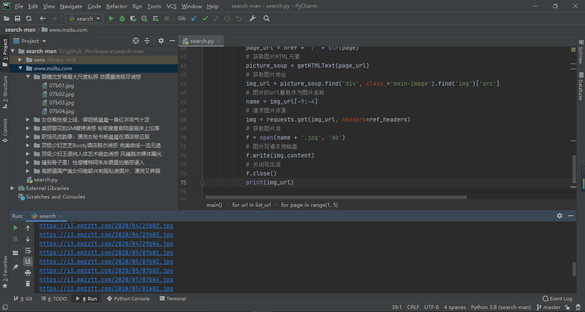

# 生成可执行文件
* python代码完成，总不能在别人的计算机上也装上依赖库，运行环境吧，接下来交给大家如何将写好的程序转换为.exe可执行文件。
```shell
pip install pyinstaller
```
* 等待结束后，查看版本，确认安装完成
```shell
pyinstaller --version
```
* 执行生成
```shell
pyinstaller -F search.py
```
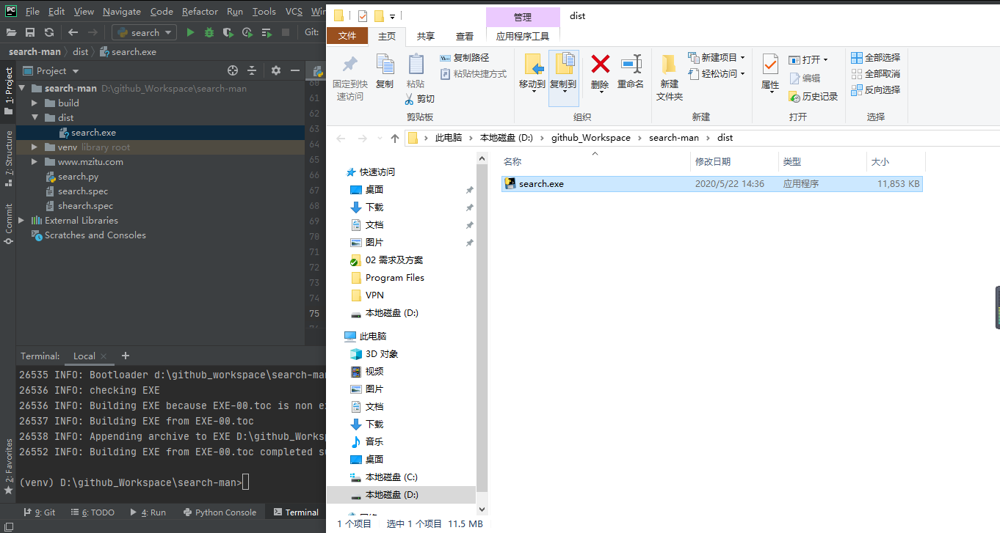

# 测试可执行文件
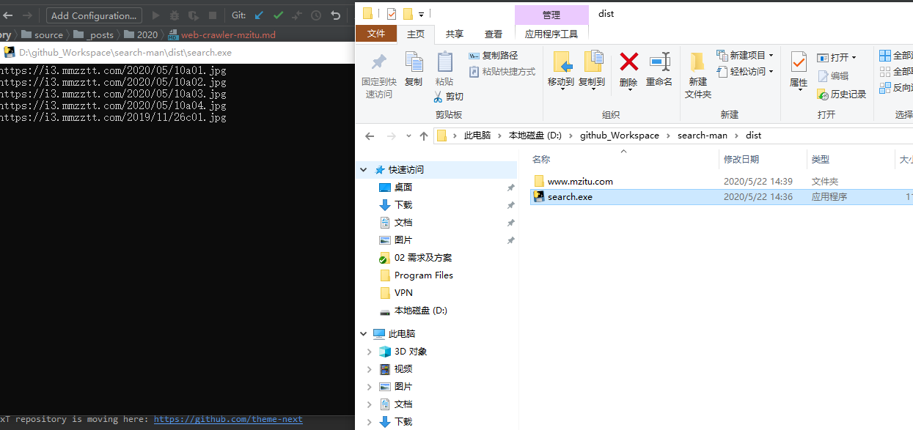
